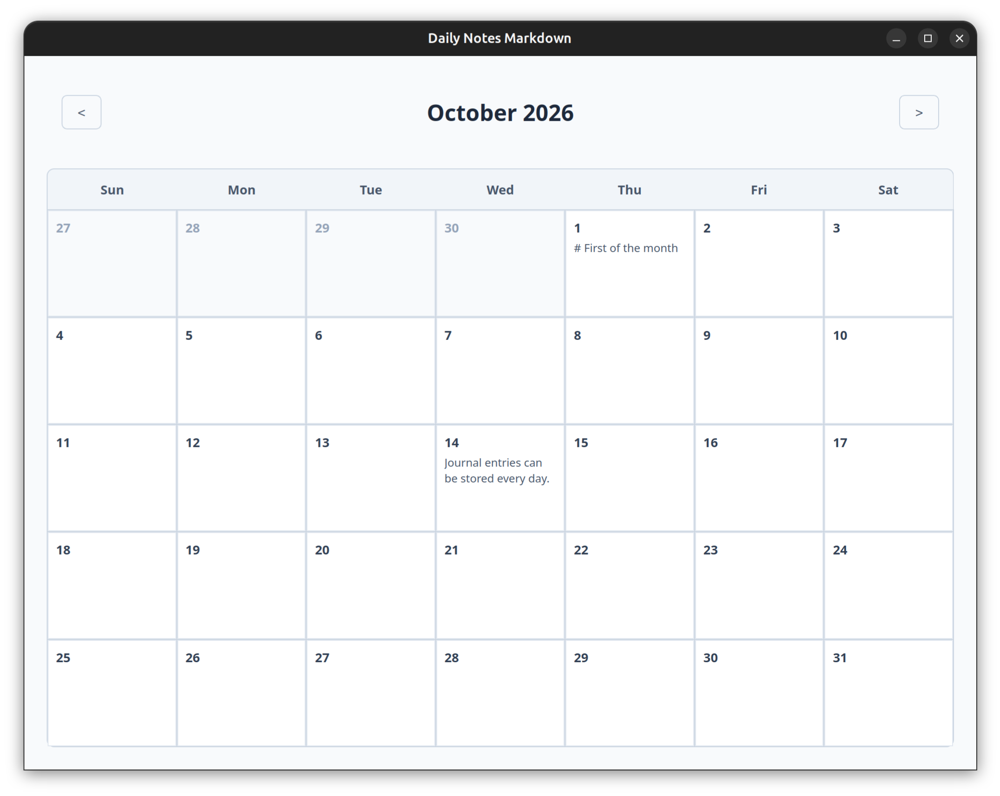

# Daily Notes Markdown (`daily-notes-md`)

A lightweight, local-first daily journal and notes desktop application built for longevity and privacy. Designed to integrate natively into a Git-backed document workflow. It is intended for developers who are comfortable building the app using npm and running from python. It has only been used on linux (Ubuntu) systems, and might need some tweaking for other OS platforms.



## Key Features

* **Local-First Desktop App:** Powered by Python and `pywebview`, leveraging native OS web rendering for high performance and low resource overhead.
* **Month-at-a-Glance Calendar:** Responsive 4-6 week calendar grid with today highlighting and clean grid styling using Web Awesome components.
* **Daily Entry Previews:** Snippets of daily entries clipped directly onto each calendar cell.
* **Frictionless Editing:** Double-click any day to instantly jump into a dedicated Markdown editor featuring live Edit and Preview tabs.
* **Timeless Storage:** One Markdown file per day (`YYMMDD.md`) stored directly inside a local Git repository.

## Tech Stack

* **Frontend:** Vue.js 3, Vite
* **Backend:** Python 3, `pywebview`
* **Data Layer:** Flat-file Markdown + Git version control

## Storage

No databases were used in the development of this app :)

Instead, journal entries are organized in a hierarchical YY/MM/YYMMDD.md structure beneath a configurable DATA_DIR. The root data directory is resolved from the environment configuration file at `~/.config/john.daily-notes/env`, supporting environment variable expansion like ${HOME}, with a fallback default for development testing.

## Getting Started

### Prerequisites

* Python 3.14+ with `uv`
* Node.js & npm (for frontend asset building)

### Installation & Development

1. **Clone the repository:**

```bash
   git clone [https://github.com/your-username/daily-notes-md.git](https://github.com/your-username/daily-notes-md.git)
   cd daily-notes-md
```

2. **Setup Python Environment**

Be sure to use system python and site packages. These are needed for pywebview to access system graphics (GTK).

```bash
    uv venv --python /usr/bin/python3 --system-site-packages --clear
    source .venv/bin/activate  # On Windows use: .venv\Scripts\activate
    uv pip install pywebview
```

3. **Build frontend in client subdirectory**

```bash
    cd client
    npm install
    npm run build
    cd ..
```

4. **Run the app**

You can run without activating the venv or installing the app by calling python explicitly and setting PYTHONPATH to the root directory:

```bash
    PYTHONPATH=. ./.venv/bin/python -u -m daily_notes.main
```
