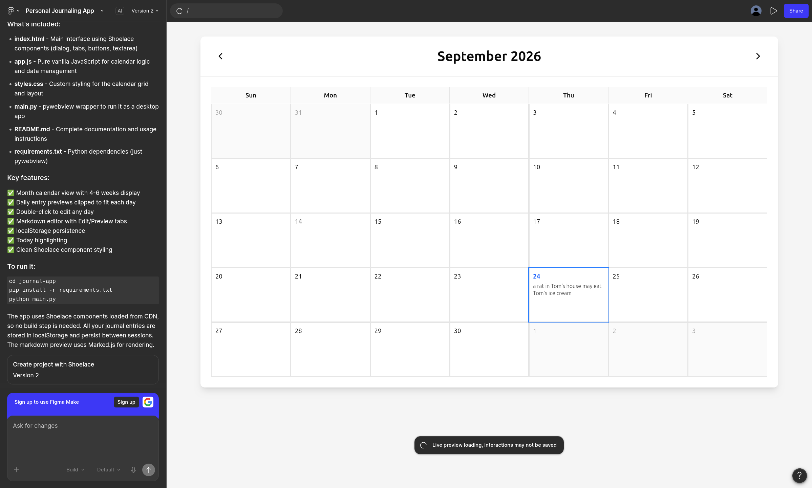

# Technical Specification: Daily Notes Markdown

`daily-notes-md` is a lightweight, local-first daily journal and notes desktop application built for longevity and privacy. It is designed to integrate natively into a Git-backed document workflow.

The main UI is a month-at-glance view with the current date, as shown in this mockup:



## 1. Architecture Overview

`daily-notes-md` uses a decoupled architecture bridged via `pywebview`. The UI runs inside a native web container and communicates asynchronously with a local Python backend exposed via the `window.pywebview.api` bridge.

```
+-------------------------------------------------------+
|                       pywebview                       |
|  +-----------------------+   JS-Python   +---------+  |
|  | Frontend (Vue + Vite) | <------------> | Python  | |
|  |      + Web Awesome    |     Bridge     | Backend | |
|  +-----------------------+                +---------+ |
+-------------------------------------------------------+
|
File System
(YYMMDD.md + Git)
```

## 2. Data Storage Specification

* **Directory Structure:** All entries reside in a configurable local directory (default: `~/.local/share/daily-notes-md/`).
* **File Naming Convention:** `YYMMDD.md` (e.g., `260924.md`).
* **File Format:** Standard Markdown with optional YAML frontmatter for metadata (tags, mood, timestamps).

Example `2026-09-24.md`:
```markdown
---
tags: [journal, tech]
created: 2026-09-24T18:00:00
---

Today's notes and reflections go here...
```

3. Python Backend API Contract

The Python backend exposes a minimal interface to the frontend bridge:

    ```
    get_month_entries(year: int, month: int) -> dict

        Scans the storage directory for files matching YYMMDD.md within the specified month.

        Returns a dictionary mapping day numbers or date strings to preview snippets.

    get_entry(date_str: string) -> string

        Reads and returns the raw content of the requested YYMMDD.md file. Returns an empty string if the file does not exist.

    save_entry(date_str: string, content: string) -> bool

        Writes the content to YYMMDD.md. Automatically stages the file change in the local Git repository.
    ```

4. Frontend Component Structure

    App.vue: Root shell managing view state (Calendar vs. Editor view).

    CalendarView.vue: Renders the 4-6 week grid using date-fns calculations, highlights today, and displays daily clipped previews. Handles double-click events to select a date.

    EditorView.vue: Split or tabbed view containing a Markdown text input area and a rendered HTML preview pane.
